# **Milestone Project 3**  - Data Centric. 

## 🎵 **Apollo - Music Review Site**

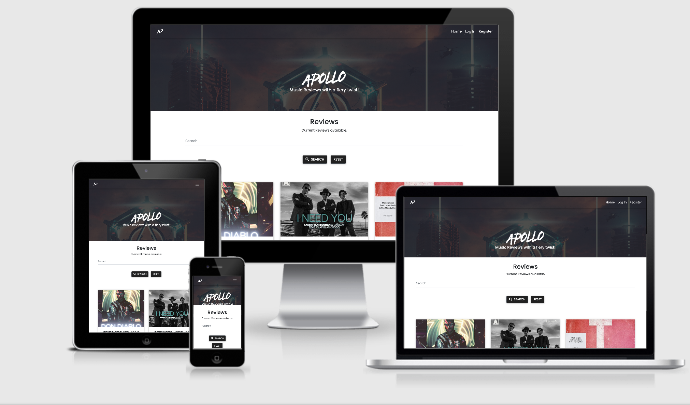

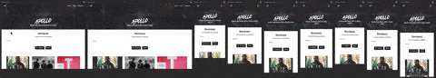


Apollo Music Review is currently deployed and can be visited directly at Heroku **[Apollo Music Review ](https://apollo-music-review.herokuapp.com/)**


--
## 📓 **About the project:**

**Apollo Music Review**  is a  music review website built using the Flask framework, simultaneously allowing users full C.R.U.D functionality of their own music reviews.

## 💻️ **Technologies Used:**
___

* **[HTML](https://developer.mozilla.org/en-US/docs/Web/HTML):** - Is the main language used in this project which allowed me to correctly structure the website, whereby using best practices to use semantic tags where appropriate.

* **[CSS](https://developer.mozilla.org/en-US/docs/Web/CSS):** - Was used via an external stylesheet using best practices to style format and visually present the HTML.

* **[FLASK](https://flask.palletsprojects.com/en/1.1.x/):** - A python framework 

* **[HEROKU](https://www.heroku.com/):** - Heroku is a container-based cloud Platform as a Service (PaaS). Used in this project to deploy the live site to the web.

* **[PYTHON](https://www.python.org/):** - Python is a backend programming language used for the CRUD functionality of this application.

* **[MONGODB](https://www.mongodb.com/):** - MongoDB is a NoSQL database, based on JSON format, using key-value pairs to store data in clusters/collections, which can be retrieved via Python.

* **[WERKZEUG](https://werkzeug.palletsprojects.com/en/1.0.x/):** - Used in user password hashing and security for the application.

* **[RANDOMKEYGEN](https://randomkeygen.com/):** - Website used to generate secure passwords, used in this application for ***SECRET_KEY***.

* **[JAVASCRIPT](https://developer.mozilla.org/en-US/docs/Web/JavaScript):** - *As part of Bootstrap* Javascript although I haven't programmed it, was included in the site as part of the Bootstrap framework so that some Bootstrap components such as the navigation toggler would work.

* **[BOOTSTRAP](https://getbootstrap.com/):** - The framework for the site allowing the use of the Bootstrap grid and responsive mobile-first approach. I Used many components from Bootstrap mainly, the Carousel, Navbar, forms and modals. 
* **[MDBOOTSTRAP](https://mdbootstrap.com/):** - The framework based on Google Material Design for Bootstrap. 

* **[GITPOD](https://gitpod.io/):** - IDE for this project. Allowed me to fork the Code Institute template from Github and open in Gitpod so that all extensions were available.

* **[GIT](https://git-scm.com/):** Git employed as version control

* **[GITHUB](https://github.com/):** - Github was used to host the repository for this project.

* **[SQUOOSH](https://squoosh.app/):** - I used Squoosh to reduce the image sizes

* **[PHOTOSHOP](https://www.adobe.com/uk/products/photoshop.html):** - For editing images associated with this project.

* **[BALSAMIQ](https://balsamiq.com/):** - Mac version to develop wireframes for this project.

* **[CHROME](https://www.google.com/intl/en_uk/chrome/):** - Not only did I use Chrome extensively for testing and bug fixing but I used the following extensions :

* **[PESTICIDE](https://www.google.com):** -  This extension inserts (with auto-reload) the Pesticide CSS into the current page, outlining each element. - Giving a good visual representation of containers rows etc, as I was using a material design from MDBootstrap I was inserting containers into containers in points to get the desired layout and style, this extension allowed me to view the layout correctly. 

* **[RESPONSIVE VIEWER](https://chrome.google.com/webstore/detail/responsive-viewer/inmopeiepgfljkpkidclfgbgbmfcennb):** -  An excellent extension suggested to me by my Mentor Allen - A Chrome extension to show multiple screens in one view. the extension will help front-end developers to test multiple screens while developing responsive websites/applications.

* **[GIFY](https://giphy.com/):** - Used to create the .gif file in readme depicting the responsive viewer in action and showing my testing on different screen sizes. 

* **[WEB FONT GENERATOR](https://www.fontsquirrel.com/tools/webfont-generator):** - Used to bring in a custom font I wanted to use for the main H1/ H2 sections, custom branding.

* **[AM I RESPONSIVE](http://ami.responsivedesign.is/):** - Used to generate the header image displayed at top of Readme.MD file depicting 4 screen displays.

* **[CSS BEAUTIFIER](https://www.freeformatter.com/css-beautifier.html):** - Formats a CSS files with the chosen indentation level for optimal readability. Supports 4 indentation levels: 2 spaces, 3 spaces, 4 spaces and tabs.

* **[PRETTIER](https://prettier.io/):** - Prettier is an opinionated code formatter for HTML CSS JavaScript etc

* **[PEP8 COMPLIANCE CHECKER](http://pep8online.com/):** - A free tool to allow the user to check their python code, to ensure it conforms to the PEP 8 standard. 
 

___

## 🧑‍🎨 **UX:** **User Experience Design (UX)**

 __Developed from the coding institute full stack web developer module on UX design.__

**What is UX:**

User Experience Design is the work, processes and skillsets involved in creating useful useable products which provide value not only to the customer but the business owner ensuring that a product not only works but is intuitive, simple, and enjoyable to use. A good UX experience is achieved by following a defined process called User Centred Design or UCD for short.

I have chosen to create a music review website with full C.R.U.D functionality and also login and registration forms, complete with password hashing from **Werkseug** following best practice UX principals and will apply them to reassess the current needs and wants of my customers and future potential clients.

I felt like tackling a business which I am currently involved in would give me a better understanding of implementing UX principals which will then allow me to generate better UX designs in the future with a stronger understanding of the core principals.

I will aim to cover the different planes in detail so that this document can be used as a blueprint for future UX development I undertake.


## 💡 **Strategy plane: The Initial idea.**
___
The basis behind the Apollo Music review site was to start a flask web app which allows users to register/browse search and add their music reviews, whether this is a professional release, from EDM to house music, to contemporary and amateur releases. 

Music review sites are a great way for musicians to self-report and share their music online and a great way to gain exposure. Not only that but as a business owner allowing users to register on the site for no charge allows massive expansion of user-generated content which I don't have to provide myself. 
This results in an ever-increasing database of music and users attracted to the site, visitors and users can share their reviews again attracting more traffic to the site aiding in its growth.

 My primary aim was to bring together many of the technologies I have learned so far to then use these technologies and comprehensively display data. I aim to bring in user-generated data using forms (through an Add review form page) and python linked to MongoDB. Thus highlighting the many skills I have obtained during this course. 

 By completing a fully functioning music review site, I will have demonstrated my experience in developing a Python-based web application with CRUD functionality.


 ## **About the business:**

The web application will be entirely online and is concerned with real-life music reviews from users who can sign up to the site for zero cost to themselves. The primary aim of the website is to display relevant reviews from users and allow them to share their reviews to accomplish two things, 1. Exponential growth through sharing of the website and 2. Expand awareness of the music that is being reviewed, be it from an independent musician looking for exposure or an individual looking for experience as a music journalist covering a major artists release. 

**Strategy to deliver above.**

* A clear and simple design starting with the Hero section displaying the Name and tag line to establish the message of the site.


**Branding:**
* I own the domain name https://hydrasound.com and my business name follows suit with the strapline and business idea name, following on from previous projects and aligned with the Greek Mythology I have chosen the project name Apollo who is the Greek god of music. 

* Logo - will be a simple design based on the letter A.

**Strategy to deliver above.**

All of the below points should fulfil 'user first impressions' (see table below) and is especially important in our B2C business.

*	Develop a logo – which is simple but effective, based on the letter A and try to symbolise Apollo the letter A and a letter. See Logo on the deployed site for the final design. The logo will also act as a link back to the home page as common practice. Increasing credibility and trustworthiness.

* A simple design structure with a navigation bar and side navigation on smaller screen resolutions accessible on every page will be essential for allowing users and readers to 'learn' the site and layout/functionality with ease. There should also be a home button/link on the logo for each page and subsequent back/return to reviews button generated on each page so that the user doesn't have to use the back button as this is bad UX. 

*	Develop a professional colour scheme – check out competitors in not only music but business-related websites. Use consistently throughout the site. For this colour scheme, I have gone with a dark blue and greys signifying trust, honesty and dependability, therefore helping to build customer and userbase loyalty. 


*	Choose a font type for the project which reflects what we are trying to achieve – research music platforms and use similar fonts. Spotify similar fonts -two come to mind straight away. “Montserrat” and “Poppins” Use consistently throughout the site. Apollo will employ ‘Poppins font’ Again I have used this method from my previous milestone project as I feel in my portfolio I wish to create a style for myself, following on from similar design and practices, furthermore, this is due to me wanting to work on a platform of products which will link to one another eventually. I feel like my own brand as 'Hydrasound' i should follow similar design patterns. 

*	Utilise the bootstrap card and grid system to display the user's reviews in a logical and easy to ‘learn’ manner.

*	Develop a footer with info section or simple copyright info bar.


| User first impressions        | How to achieve          |
| ------------- |:-------------:|
| **_Does it look credible and trustworthy?_**  | Yes – through the colour palette, fonts,  logo, social proof of good quality control and reviews. |
| **_Does it offer what I want?_**  | Yes – Simple use of CRUD functionality and achieves only what is intended, users the ability to register to the site, add reviews, edit and delete reviews. Readers of the site can view reviews on the home page and view extended versions of the review on their pages, with easy access back to the main home page. |
| **_Does it look valuable enough for me to stay?_**  |.Professional design, clear and simple navigation, displayed is an easy to read manner. Mobile responsive. |
| **_Does it look valuable enough for me to return?_**  | Yes, free to use but professional design, deployed on a secure platform, quick responsiveness and easy to 'learn' with all features of a review site available |
| **_What actions can I take now?_**  | Users who aren't logged in will see a clear navigation item which says 'register' |
| **_How do I learn more?_**  | An info modal is available giving a brief overview of the site and how to use it, along with direct buttons to register |
| **_How do I contact someone?_**  | Footer provides direct contact details for the webmaster. Similarly, a web form can be accessed from a menu item called 'Contact'|


**What is culturally appropriate**
Concerning this music review project I have found that the brand name stands for a lot right from the offset. Our website is only concerned with displaying reviews within the music industry, so no Movie reviews or fishing rod reviews.
We keep the site strictly about musical endeavour and focus solely on providing the users with the ability to create their music reviews, edit and delete them. They will also be able to build up their name as a music reviewer, as I have created the 'review_by' functionality at the bottom of the review. So users can build up a database of their reviews, which can be displayed on their profile page. Furthermore, by adding them to their profile page, we allow the user the ability to manage their database of reviews, add to and review their work in their section of the site. 

I have also developed the site to be mobile-first as our demographic for clients looking for our services seems to be in the male category and age range of 22-34, whereby we know its highly likely that users have access to a smartphone and will be accessing our website from mobile.

**Tracking and cataloguing content in an intuitive way.**

Regarding the display of the content I have opted for a typical section style layout to the site, this meaning I have a hero section and subsequent blocks of content each separated by alternating background colours, an off white and white to ensure content separation is apparent. 

The use of Flask /Python loops will allow the display of reviews in a card, each iteration will generate a new card with the subsequent review. In time I may break these loops down to Genre specific headings and make reviews searchable by genre, however as the site is in its infancy I have opted to generate all reviews in cards utilising the bootstrap grid system displaying no more than three cards per row.

Typically in modern web design, a hero section is employed so I have taken advantage of that with a centred H1 and H2 Heading for the site title and strapline, using a more bolded font to make an impact from the first-page load. This screams to the user, this is the site title and this is what you can do here.

I also used a background image which is relevant (musically) to display the field the website is addressing. One concern is the bright image was taking away from the Hero text, so a background overlay was used to fix this. Not only that but the background overlay is the main colour in the colour palette chosen again adding to our branding and overall UX experience for the potential client.

**What is the importance of this.**

From the first time the user visits the website we want to display a level of professionalism and ease of use, not only that our straplines, branding and colour palettes are correct but our content is distraction-free and displayed easily enough that a user can learn about our website and feel at ease very quickly. 

With minimal distractions and a simple interface, it will become easy for the user to quickly learn the site and sign up for an account and start creating content for the site. 

**Why would a user want this.**

There are other similar website applications available to the user which offer the same basic functionality as Apollo, so its important to quickly allow the user to learn the site sign up and create content with little distractions as possible. I have deliberately simplified the application to allow for this. Typically a user from visiting the site can sign up and create a new review in less than 5 steps. 

1. Visit the application 
2. Click Register
3. Register account.
4. Add review.
5. View Published review. 

This ease of use and free registration will encourage return users to the platform and again allow users to grow through external content creation. 


**What creates a good User Experience concerning this online Music production service finder business.**

*	Strong branding – colour palette – typical industry typography.
*	Displaying relevant content. - From only hosting/allowing music reviews from Major artists and displaying content which is of value to readers.
*	Social proof – adding social sharing to all reviews allows for users to share their work and in return increases traffic to our web application.
*   Overall ease of use, as highlighted above, the 5 steps from learning the site to publishing is imperative. I have used previous sites which require far more effort and are often more complicated to learn. Simplicity is key.


**What does the user/client expect?**

*	Strong Branding- Does this website come across as an authority in its field. I feel this is true by the use of correctly structured content, branding font type and also consistency throughout.
*	Pricing – This is completely free, we may in our terms allow free use to contact users at a later date to offer other premium services. 
*	Ease of use? - 5 steps from initial visit to signing up and publishing the first review.
* Support - this is currently only available from a contact form, however as the site is simple and efficient I believe this is a minor addition to the free service provided. 


**Prioritisation – To launch a Minimal Viable Product.**

We can address which features should be prioritised primarily by developing a map of importance and viability/ feasibility.
For this project, we will be focusing on UX efforts of higher importance and developing features of lower importance and viability/feasibility further in the timeline of this project.


| Opportunity/Problem       | Importance         | Viability  |
| ------------- |:-------------:| -----:|
| **_A.     Allow users to register and create publishing account_**       | 5 | 5 |
| **_B.     Display each review on their own page_**      | 4      |   5 |
| **_C.     develop a top user and ranking system for contributors_** | 2      |    2 |
| **_D.     Develop a chart system from the chilli rating functionality_** | 2      |    3 |
| **_E.     Group reviews to categories_** | 3      |    3 |


**Graph of importance to launch our MVP from the previous table.**

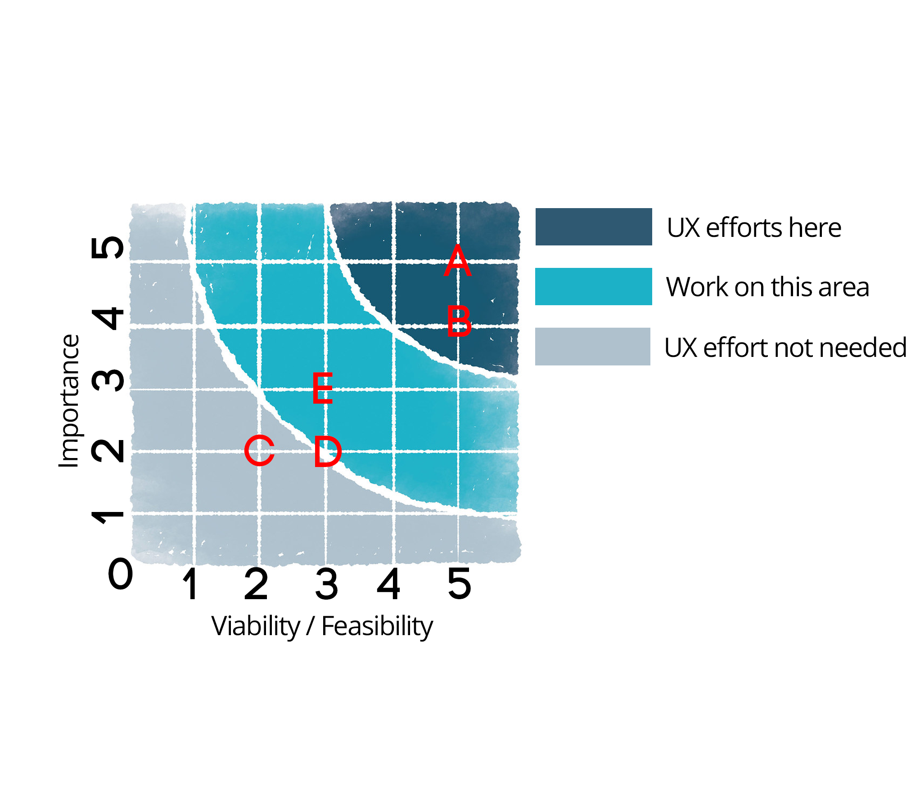


As referencing the above prioritisation matrix my UX efforts will be hence focused on areas A and B which will satisfy the CRUD app criteria of the grading process. 
Thus I will develop the application to allow users to register and create their accounts whilst also displaying that review on its review page using an appropriate app route decorator to grab the review id and generating the content from MongoDB and displaying it on a page called view_review.html. 

By developing the app in such a manner it will allow me to simply hard code one-page view_review.html and not create multiple pages for each review submitted.

## 🧰 **Scope Plane - requirements and functional specifcation**
___
### **What users and stakeholders - Say they need**
**User Stories**

* Speaking to several budding music journalists I have found that very often people who want to become music journalists or write like a professional for magazines will be required to have some form of publishing past or evidence of their writings. 
Music reviewers or journalists will want to share their work with other people and if they don't have access to a personal blog, or want to be inclusive of other writers they will need to join a platform which allows for this. 

* The user visiting this type of website wants a professional website easy to navigate and also read reviews of relevant content, for in this instance - Music reviews. 
* Not only that but if the user wishes to use the site to publish their reviews they will also require a site that will allow full CRUD functionality, simplistic to use and allow their content to be displayed in an easy to read and eye inviting manner. 
* They need to be able to share their work across platforms. 

### **What users and stakeholders - Actually need**
They need a clean and tidy designed website which is mobile responsive, highlighting the latest music reviews, a button from the front page to allow the user to read the full review.

* As a user/publisher on the site, they require ease of use with full CRUD functionality, to publish amend or even delete their work. 
* They will also need a means of sharing said content with others on their social networks or to potential employers. 

### **What users and stakeholders - Don't know they need.**

* As the site owner, they will want to be able to monitor and update the site, I have initially started this process by creating an admin user who can create new genres and add those to the database. 

* As a working business website, we have to abide by GDPR rules, so a pop up advising the client on our privacy and how we use their information would be needed down the production line. This production app will not have this in place but will be if deployed.

* Other desirable features may include, more services for music promotion.

* Social networking feature – not essential but desirable, perhaps a Twitter/Facebook like entity where users can register to the site share their music writing tips and advice, this would allow for content to be shared cross-platform and to other social media accounts, drastically increasing awareness of our web application. Or for people to use the site as a personal blog, create friends and discover shared interests. 

* An iOS and android app – it is true that many users now if these features down the line are implemented that developing an application would be of extreme benefit, it would allow extra monetisation brand awareness and next-level professionalism.


### **User Stories - Needs / Goals and how to achieve.**


#### Site Member

| Needs / Goals       | Task        | 
| ------------- |:-------------:| -----:|
| **1.     _An easy to use music review site_**       | Make sure the site is easy to learn and easy to navigate | 
| **2.     _Display each review on their own page_**      | Create the route app decorator to grab the ID of the review and use a template to generate the page pulling data of the review in from MongoDB       |  
| **3.     _Discover new music and artists_** | Allow further search functionality alongside adding charts for top-rated reviews and users, this will encourage the use of the site more frequently.      |    
| **4.     _CRUD functionality_** | Give access to features allowing the user to create, update and delete their reviews without the need for an administrator      |    
| **5.     _Exploration of the site_** |   Group reviews to categories, employ the use of carousels for swiping of reviews, or categorise by rating/genre |    


#### **Site Owner**


| Needs / Goals       | Task        | 
| ------------- |:-------------:| -----:|
| **1. Share my own reviews**       |Giving access to full CRUD functionality |
| **2.     Management of genres**      | Administrator account has a separate function to create new and accessible genres for all users to take advantage of. This can only be managed by the admin account, thus encouraging users to reach out to site administration to add specific genres, this stops users adding genres which are unknown or not useful to the site.      | 


** First-time visitor Goals**

* Allow visitors to learn that the site is a music review site
* Home screen prompting registration if logged out. 
* See snippets and general rating of reviews on the home page.

**Frequent visitor Goals**

* Encouragement to register for more functionality.
* Read and learn more about the music and reviewers on the site.
* Share the music reviews to their socials.
* Publish their music reviews with the CRUD functionality so the ability to edit and delete if needed (encouraging publication as can be deleted if not confident)


**Development Goals**

* Demonstrate a solid foundational knowledge of the Python language and the Flask mini framework.
* Increase knowledge of MongoDB through CRUD dev.
* Build up a portfolio of relevant projects suited to my needs (ie music industry). 

**Website owner Goals**

* Encourage site use and exposure from allowing sharing and having a site that is easy to learn and use. Simple and effective interaction. 
* fewer steps to publishing as possible vs competitors. 
* Easy registration to onboard new publishers, allowing for exponential growth through 3rd party content creation.


## 🏗️ **Structure: How we present information:**
___

The web application will consist of typical navigation and structure which will conform to web best practices. By this, we would expect the navigation menu items to be located to the top right-hand corner of the web app. To the left, we will employ a Navigation bar logo which doubles as the main Home or index.html link.
As it stands there will only be 2 pages, this is because I have employed the Flask templating method to my web application, endpoint URL for users will be view_review.html and an associated review ID pulled from MongoDB. This implementation was chosen as I don't have to create new pages per review generated, I am gathering all data from MongoDB for all reviews.

The menu items are only one level consisting of a linear structure, so no nested pages as of yet. The structure is as follows.

#### **LOGGED OUT USERS:** 

#### **HOME---LOGIN---REGISTER :** 
* For logged-out users, the user will only have access to options which encourage registering to the site. A login option or a registration option.

#### **LOGGED IN USERS:** 
#### **HOME---PROFILE---ADD REVIEW---GENRES(ADMIN LEVEL)---LOGOUT:** 
* If the user is logged in, a more extensive list of menu items are available, for instance, the ability to add a review will allow the user to visit the add review page and add a review. 
* A profile page will allow the user to display their reviews, each with buttons for CRUD functionality.
* Admin level will have access to Genre level, whereby the admin can add custom Genres to the database and manage accordingly.
* Finally logout for users to end their session and securely log out from the application, removing the session cookie. 


### **Information on structure regarding page layout and design:**
 The general structure of pages will consist of a navbar, a hero section and then relative content to that page, structured using the projects fonts, font sizing and colour palette.
* As discussed earlier I have opted for a content block approach which will allow me to display content in a clean and structured manner. These two points allow the user to learn the layout and feel of the website quickly.
* Each page will have working navigation whereby the Apollo **A** Logo will return the user to the home or landing page.


* The footer/ Copyright consists of two sections positioned centrally and away from the edges of the site so that any information can be viewed without scanning from left to right on larger screen resolutions. I discovered this as I work on a 27inch iMac and having to content full width at this size is bad for UX in my personal experience.
Regarding the footer, section one or block one will have an information box
section the second will offer my contact details.

* view_review.html will be a hardcoded template page which pulls in **BSON** data from MongoDB, this will allow me to create one hard coded page allowing me to display the correct review data for the selected review. 


### **IXD:**

The hero section is not full viewport height it uses the CSS style  `height: 45vh;` with next sections always visible, this promotes scrolling and intrigue.
* Colours fonts and structure are reused throughout the site.
* I did, however, add an animation class from Animista which was used throughout the site on the hero text and strapline,
it plays once on page load and is a fade animation, which I feel adds a subtle but impressive introduction when visiting pages. No further animations are employed, to not over complicate or draw attention to less important areas other than the reviews themselves.


### **SCHEMA - DATA & MVC**

* Choosing a data structure for this project has been considered, and I have opted for a NoSQL approach using MongoDB with a data model which is well organised and matches the schematics of the project. 

* All Data resides in MongoDB in a cluster and using one database called _**apollo_review**_ 
* I have separated collections of data in to 

1. Genres  - Which hold the Genres data 
2. Reviews - consisting of all key-value pairs of data to populate the reviews. 
3. users - a collection of all users registered to the site. 

* MongoDB view below shows the structure of my database as pre-planned when addressing MVC framework conventions. 

#### Apollo Review database structure: Collections:

* Below shows the database collections and how I have separated some data into different collections for ease of use and management. 
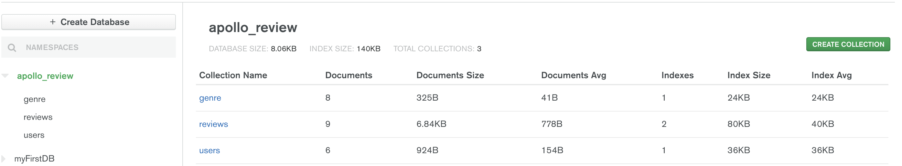


#### Apollo Review database structure: GENRES Collection:

* I decided to use a separate collection for Genres as I have a feature in the admin panel to add and remove / genre management system, by using a different collection allowed me the freedom to use CRUD functionality regarding adding new genres, editing those genres, seeing the genres reflected instantly in the add and edit review sections of the site and the front end reviews and to also delete genres from the database.
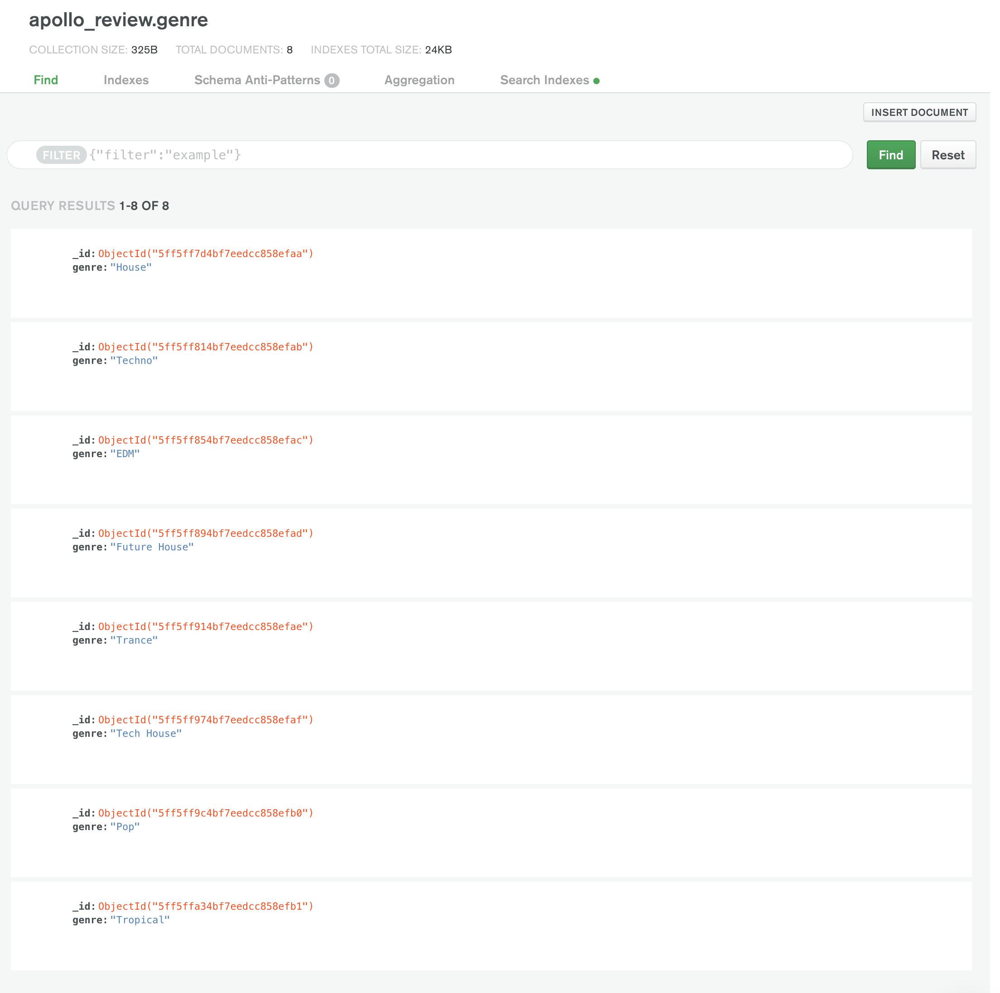

#### Apollo Review database structure: REVIEWS Collection.

* The reviews collection consists of the main pieces of data used in the add review form and also the View (MVC and front end) it allows for these forms to require these pieces of data and input them to the collection of the apollo_review database, to be used in the front end view of the review page and also the view_review pages. These key-value pairs can also be deleted or edited by the user who created the review.  

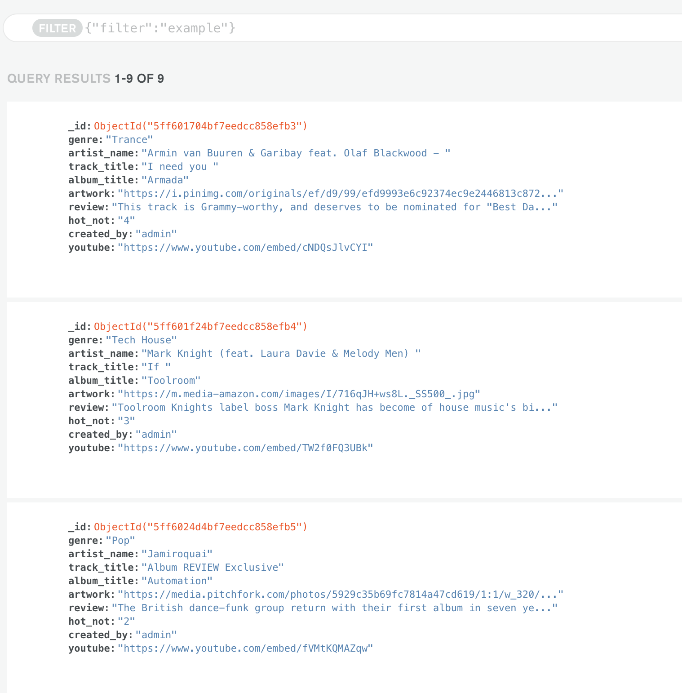

#### Apollo Review database structure: USERS Collection:

* Users were separated to their collection within the apollo_review database, again mainly to achieve a logical approach to structuring data in the backend.  

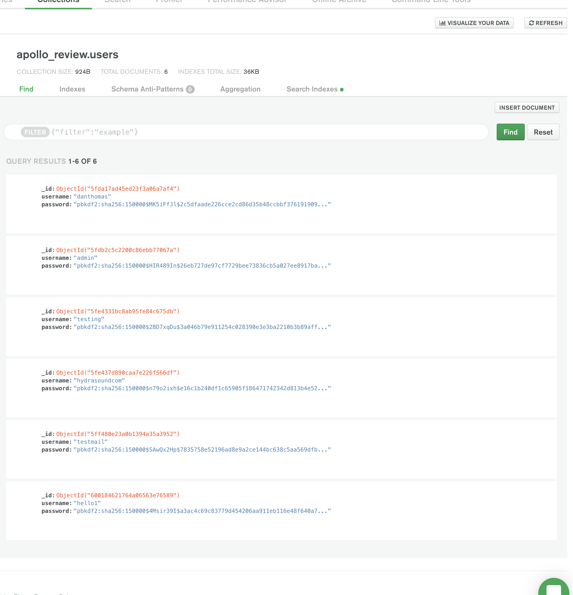


## ✏️ **Skeleton Plane – Interface design, navigation design and giving form to function:**
___

As with every project which is to be taken into production it was essential to firstly wireframe the project. This would allow me to test out different ideas layouts, navigation and presentation which is expected when visiting this type of website. I developed the wireframes using the Balsamiq software which allowed me to produce low fidelity mockups of the finished web application without the need for coding it first. This saved immensely on production time and allowed me to have a 'map' of how to finally code the app.

_**Please note – these wireframes may differ slightly from the result.**_

___


#### **Wireframes.**
* I have included the wireframes as a separate .pdf file as there are 7 pages, so instead of cluttering up this readme, feel free to download or view on Github using the link below.


### **Skeleton plane cont:**

In this project, we are only focusing on data presented and data in motion through the use of BSON from MongoDB and the input of that data provided by registered users of the application.


The data presented should be done so in a logical manner with ease on the eye and interesting to the end-user, it should also be simple to read and only present important data as to alleviate cognitive overload from the end-user. This is achieved by presenting only the important pieces of information from the review as needed, in this case: 

* Artist Name - using a secondary font
* Artwork - As a heading image.
* Track Name - in bold part of info block
* Album title - in bold part of info block
* Chilli rating - In Red and bolded employing the use of the correct amount of chillis to reiterate score.
* Review - A simple text block, spaced as a justified text for ease of reading and presentation of said text.


Navigation has been assembled in order of priority from left to right and all links and internal links are well displayed (many as buttons) and working.

Furthermore, I found no need for pagination at this point to display data and also provided menu items and buttons with relevant font awesome icons to aid in web application learning to the end-user. Data is presented the same throughout the web app alongside colours, fonts and branding all aiming to allow the end-user to learn the web app easily and subsequently enjoy using it.


### 🚀 **Surface plane:**

Using all the planes above and the data presentation and all the research carried out I was able to present all of this with my project.
I hope you enjoy browsing my web app and I look forward to developing it further.
In ending this UXD analysis and a quote I feel summarises this whole process I will leave you with this.

> “ Good UX smells like value. Ask yourself the question whenever you're building a project, does this smell like value?”

Brian O'Grady - Code Institute


## 📦️ **Features:** 

* The web app is mobile responsive with a collapsible toggler navigation. I used a mobile-first approach to this project ensuring that mobile access was of high importance.

* The Logo position left always takes the user back to the Home page.

* Expected use of font-awesome icons to assist in users learning of the site.

* Use of animation for hero text - minimal use of animation but effective for a pleasurable experience on page load.

* Footer features on Index.html with information section populated with my information. 

* Reviews utilizes bootstrap cards which display Artwork image and content relevant to the review, encouraging click through from the button below.  This was templated using the Flask framework. This allowed the developer to create one template card which was used to create all the data cards for the users, through creating loops for the reviews.

* A user-friendly interface with easy navigation and learning of the whole application, through minimal design, visuals and information presented in a predictable but expected fashion. 
Furthermore, all fonts and colour schemes are consistent throughout the application, from login panels to registration, all consistent to create a continuous feel and wholeness to the app. 
Expected font use and consistency in font sizing and weights allow for an easy reading experience. 

* Buttons are all styled the same and placed strategically to ensure the user has an enjoyable experience using the site. 
* Forms are all styled using MDBOOTSTRAP's form control giving a slick and professional look instead of the standard form design. 
* Card use for review listing and uniformity. I have used cards concurrently in my projects as I feel they are an exceptional way of containing and managing content to present on the site. 

* Search functionality - was extended to incorporate most iterations or expected search strings and enquiries, so if a user wants to search by genre, track name, user, or any other typical string the search functionality can handle that. 

* Flash messages are employed to allow/alert the user if they have logged in, logged out, submitted a review to the site correctly etc.

* User registration with login and log out functionality - This function was added albeit not essential for the project development/criteria, however, I added this extra functionality to showcase a strategy for encouraging users to return to the site, by having their registration on the site will be more appealing for return visits. 

* CRUD functionality for registered users: Allowing users to fully control the content they submit to the site allows for a return and frequent visits, not only that but it encourages social sharing of their content. 

* Allowing 3rd party content creation - through user accounts we allow for 3rd party content to be created, not just from the site owner. This will allow for exponential growth to the site, in turn increasing traffic and allowing for better SEO results. 

* Mobile Responsive - This site has been tested to ensure that a mobile-first approach and layout is clean and effective, the delivery of content and readability on smaller devices was paramount. This was achieved by the use of the Bootstrap Grid system and custom CSS media queries allowing for content to be resized on smaller screens and thus utilising optimum screen real estate on smaller devices, all information is grouped and presented expectedly, aiding in ease of 'learning' for new and returning users. 

* Buttons have been used extensively to allow for easy navigation when scrolling, as the navbar isn't sticky and resides at the top of the screen, the use of buttons to return the user to the home sections or read more, edit reviews and delete are all important in ease of use for the end-user. 

* 404.html - This was not needed as part of this project however I did when testing my URLs mistype a few by accident, which returned server errors as expected, so I did a google search on how to implement a 404 page which will allow users to safely navigate back to the home page if they end up on a page which isn't expected or not found. This has been credited below however I feel this was a great addition to the site outside of the scope of the project but adds a lot of value to the site owner and end-user. I added a return to home button and incorporated the Navbar so that even if the user finds themselves lost they can easily return home or use the navigation bar to find what they were looking for, instead of using the back button or having to retype the address and refreshing the application. 

* Modals - I incorporated a modal into the navbar with the title ABOUT - which allowed me without creating a new page a fly out modal, to give quick tips on how to use the site including links for users who are just visiting and don't have an account, they may register or login. Also, there is an href mailto: my email if they wish to contact me directly. I May opt for a contact form in future however this is not needed for this project, as we are primarily focused on DATA. 

* Search bar with full function index search - all search strings were incorporated in to the search functionality including: artist_name_text_track_title_text_album_title_text_genre_text_review_text_created_by_text, this is to ensure that all possible text strings associated with the reviews including review genre would return results. Conversely, I haven't at this stage included a rating search, as this project is ongoing and will be implemented at a later date once charts and other user functionality are developed. 

* Youtube Embed - Allows the user to input the youtube embed URL to the database and display the youtube video on the review page. Giving the reader the chance to not only read the review but listen to media. 

* Defensive design - After failing to integrate sufficient defensive design into the previous project I made sure that this project was 'Rock Solid' from using fort Knox level SECRET_KEY's to setting required attributes to all form elements and also setting minimum and maximum input values, not only that but for inputs such as artwork and youtube embed I implemented this code ` pattern=" HTTPS://.*" required `  to ensure that only SSL HTTP connections following the correct URL pattern were allowed to be submitted to the database. All other form elements are required and no form can be submitted without adhering to my strict criteria. 

* Following on from defensive design, I also ensured that the delete and edit buttons for reviews are only visible to the user who created that review, this was implemented by using an 'if' statement shown below. This will prevent users or visitors just logging on to the site and deleting content which isn't theirs.

```html 

            
    <i class="fas fa-user-edit"></i>
    <a href="{{ url_for('edit_review', review_id=reviews._id) }}"
        class="btn btn-sm btn-dark">Edit</a>
    <a href="{{ url_for('delete_review', review_id=reviews._id) }}"
        class="btn btn-sm btn-dark">DELETE</a>
    
</div>

</div>

 ```

### **Security:** 
* I used Werkzeug for password hashing to ensure encryption of users passwords to the MongoDB. In time I may increase security by adding more user registration security features, however, for this application the implementation of Werkzeug is sufficient. 


### **Further Dev plans**: 

> **Ongoing project notice:** 

* I feel this project satisfies the criteria set out to which I wanted to achieve however I have further plans to branch this project to create a better experience again for users and readers of the site to which may include: 


* Music charts - A rating system which can be developed from the original system I have in place but instead of user ratings - allow for readers of the review to rate the review and track, which will then give an average score which I can then use to generate python-based charts and leaderboards. 

* User discussion forums may be of use so users can interact with one another or similar simple social network type functionality where users can add friends or follow reviews who they enjoy reading their reviews, or have similar interests. This will create a community. 

* Extend the review functionality to incorporate links to the music, such as Youtube embeds, Spotify follow buttons etc. This would be essential if I were to launch this as a viable business opportunity for an end owner of the site. 

* Change the URL input for artwork to an upload form - this would allow users to directly upload their artwork instead of sourcing or potentially hotlinking from other sites. 

* Extending the registration process to include an email address in the sign-up - this will allow me to (GDPR allowing) create an email database of registered users and to contact them when needed. 

* Categories - As the site grows there should be a significant extension of the site layout to incorporate growth, this may be grouping reviews by categories such as by genre and displaying only top reviews on the home page in a carousel and linking to a separate genre-specific page, this will help in allowing readers to find and explore music they are interested in only. 


* Advertising space - revenue generation or sponsored reviews - allowing fund generation for the site in return for better site positioning or exposure. 


### **_Code Refactoring_:** 
___
In this project I also used the extension to Gitpod called prettier which would format my code, however, I then went through each page and ensured there were no excess lines of whitespace. I also chose a uniformed way of commenting display, whereby I left a line gap either side of my comments so that people can distinguish between code blocks. I feel it was just a neat way to format my comments. 

Furthermore, to this, I used an online tool which formats my HTML and CSS to conform to best practice, so in my final (for deadline purposes) commits I will be formatting the HTML code from the formatter, as credited below.  

## 🧪 **Testing:**
___

Testing was an integral part of the design and build process, responsiveness is crucial to the success of any online website so several steps were employed to ensure that the site worked across several platforms and browsers.
Not only responsiveness but positioning, colours, inheritance etc were all factors to be taken into consideration, thus Google Chrome developer tools were used extensively to test all aspects of the site.
Although Bootstrap is a mobile-first approach I opted to work on a simple desktop version first as I could work backwards.
I first of all set up a few .css rules for the body section which allowed me to set some global rules such as.

<!-- Code Blocks -->
``` Css
  * {
  box-sizing: border-box;
}
```
Which made sure that I was working with the box model more logical. 

One other major factor I came across is when using `.container-fluid` my content was as expected at full width across the screen, which for some sections I liked but on bigger screen resolutions I found for UX purposes I needed to set a max-width so that the content didn't spread across the page. I found this looked sloppy and not good in terms of design. I tested this too out with dev tools to create a `.container-max` rule which for large screen resolutions the content was displayed better.
Resulting in: 

``` css
/* container to pull in content on non full width containers */

.container-max {
  margin-left: auto;
  margin-right: auto;
  max-width: 1400px;
  padding: 15px;
}

```

Furthermore, I implemented a media query after using the Responsive Viewer extension for chrome and it was evident that the hero txt on smaller screen resolutions such as iPhone 6-7 it felt like the hero txt was too low in comparison with other screen sizes I used this code to rectify the problem and images below show a before and after comparison of a better-looking UX 

```CSS
/* media query from chrome - the addition of this media query to line up hero text better on smaller screen sizes. */

@media all and (max-width: 425px) {
    .hero-text h1 {
    font-size: 50px;
}

/* media query from chrome */
 
   .hero-text {
    text-align: center;
    position: absolute;
    top: 30%;
    left: 10%;
    right: 10%;
    color: white;
}

```


## 🧪 **User Experience testing:**

As this website is aimed at getting users to interact with the site through reading reviews or by registering to the site to become a user/review of the site I had to ensure that in my testing I adequately tested the UX and that it was simple enough for the user to "learn" how to use the site and follow industry standards and user expectations.

This translated into me using a top menu bar with LOGO positioned to the left as expected.
For this website, I haven't provided an extensive array of menu options, only as much as necessary to accomplish what the site sets out to achieve. So at this point in the web application infancy, I haven't set menu options for the latest reviews, top reviews, top reviewers etc. I am keeping it basic to maintain simplicity.

I used many inbound links and tested all links ensuring that they all work and link correctly, this had to be tested on each review and review page as all data is being populated from the MongoDB database collection. So although I only have an index and view_review.html page as the main two pages for 90% of interaction in the app I had to test each page thoroughly as these pages are generated from user data pulled from MongoDB and all buttons and cards dynamically create their pages templated from the view_review.html template.

I have logged my testing below to ensure that this web application is 100% functional and complies with defensive design.

**User Experience: from top to bottom testing each feature for bugs**

**Home / Navigation.**

* Home Button always returns the user to index.html
* Apollo Logo always returns the user to index.html
* Profile menu item always directs users to their profile page.
* Add review menu item, always directs users to the add review form.
* Login directs users to the login page
* Logout logs out users and removes session cookie for the user.

**Home / Search.**

* Search Bar functioning and works for all string queries input to the text box.
* Search Bar - doesn't work at this moment in time for chilli rating (this is intentional)
* Search Bar - search button activates the search from an input string.
* Search Bar - reset button resets correctly and returns a full array of reviews. 
* Search Bar - reset resets search string on input if selected.

**Home / Review cards.**

* Review cards - Display 3 column on mid and large screens only as required. Effective us of the grid system. 
* Review cards - display review image as card image header. 
* Review cards - Artist name displays for each review.
* Review cards - Track title displays for each review.
* Review cards - Album Title displays for each review.
* Review cards - Genre type displays for each review.
* Review cards - Chilli rating uses correct if elif statement for each review, and displays the correct amount of chillis corresponding to a rating of the review.
* Review cards - Chilli rating - statement ie 'Too hot to handle, firecracker' displays correct and working. 
* Review cards - Read more button, redirects user to the corresponding review, using view_review.html template. 
* Review cards - Review by ` <name> `.  ie admin, displays correct info. 

**Add Review.**

* Add Review  -  Hero section inherited from base template displays correctly.
* Add Review  -  Form to add review displays correct and employs defensive design. 
* Add Review  -  Artist name field only allows correct input criteria, required field active
* Add Review  - track title field only allows correct input criteria
* Add Review  - Album title field only allows correct input criteria, required field active
* Add Review  - Artwork URL field only allows correct input criteria accepting only a URL. required field active
* Add Review  - Genre selection fields displaying correct from genres input in MongoDB, can be selected and working, required field active 
* Add Review  - Review text box allows text input and required field active. 
* Add Review - Hot or not Chilli rating works as expected and returns correct chilli rating value on each review. required field active 
* Add Review - Send button uses post method and allows data to be input to MongoDB. required field active. 

**Review / Edit Review.**

**Review / Edit Review.**-  
* Hero section inherited from base template displays correctly. 
* Edit Review  -  Form to add review displays correct and employs defensive design. 
* Edit Review  -  Artist name field only allows correct input criteria, required field active
* Edit Review  - track title field only allows correct input criteria
* Edit Review  - Album title field only allows correct input criteria, required field active
* Edit Review  - Artwork URL field only allows correct input criteria accepting only a URL. required field active
* Edit Review  - Genre selection fields displaying correct from genres input in MongoDB, can be selected and working, required field active 
* Edit Review  - Review text box allows text input and required field active. 
* Edit Review - Hot or not Chilli rating works as expected and returns correct chilli rating value on each review. required field active 
* Edit Review - Ammend button uses the post method and allows data to be input to MongoDB. required field active. 
* Edit Review - cancel button successfully cancels edit operation and returns the user to home. 

**Review / Delete Review.**

* Delete Review  -  Successfully deletes a users review from the database/cross-referenced by checking MongoDB for successful deletion. 

**Register.**

* Register - Takes two inputs to the form Username and Password both utilising defensive design, required attributes and must conform to ` pattern="^[a-zA-Z0-9]{5,15}$" ` 
* Register - button successfully registers the user to the database under the database **_apollo_review-users_** 

* Login - already a member login href, redirects user to the login page.


**login.**

* login - Takes two inputs to the form Username and Password both utilising defensive design, required attributes and must conform to ` pattern="^[a-zA-Z0-9]{5,15}$" ` 
* login - button successfully logs in the user and creates the session cookie in the browser.

* register - no account, redirects user to the registration page.


**Screen size testing**


As displayed, I used the Responsive Viewer Chrome plugin to test a multitude of the most popular screen sizes available. Which included.

* Medium Screen - 1024x800 
* Large Screen -  1280x800
* iPhone 8,7,6S,6 - 375x667
* iPhone 8 Plus, 7 Plus, 6S plus - 414x736
* Galaxy S9 Plus, S8 Plus - 412x846
* Pixel 3, 3 XL - 393x786
* Galaxy S9, Note 8, S8 - 360x 740
* iPhone XS, X - 375x812
* iPhone XR, XS MAX - 414x896


___

### **Further Testing:**
* The use of validation services for **[Jigsaw CSS Validator](https://jigsaw.w3.org/css-validator/)** and **[HTML Validator](https://validator.w3.org/)** allowed me to modify and fix any errors in my code, 


### **Results from CSS and HTML validation:** 
No errors found I did use the direct input to the CSS validator service as I am using external frameworks such as Bootstrap and MDBOOTSTRAP which did return some warning errors when using the URL input. However, these are out of my control so opting for direct input of my CSS allowed me to test my code only. 

### **CSS Results:** 

* CSS testing found only errors withing the MDBootstrap CSS - all written CSS passed validation, apart from WebKit-animation and WebKit-filter which is an external library I used for  H1 animations and out of my control. 

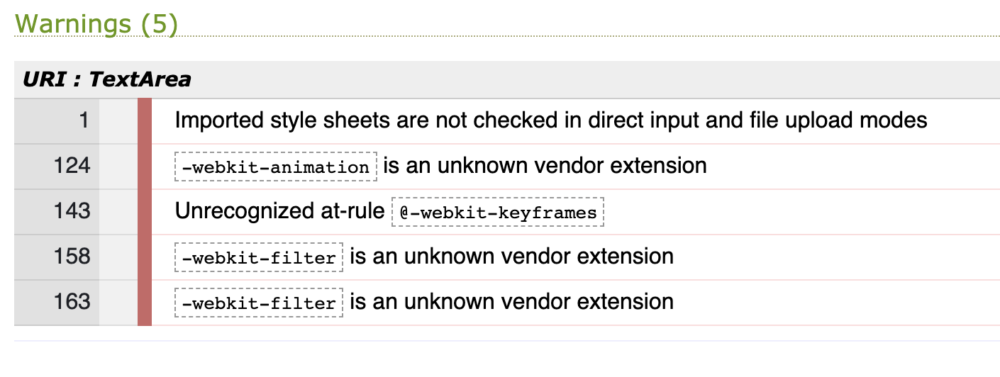


### **PEP8 Results:** 
No problems resulting from PEP8 testing and compliance of app.py file using http://pep8online.com/
apart from 2 lines being too long, however, all major tests passed and no errors and indentation all correct.

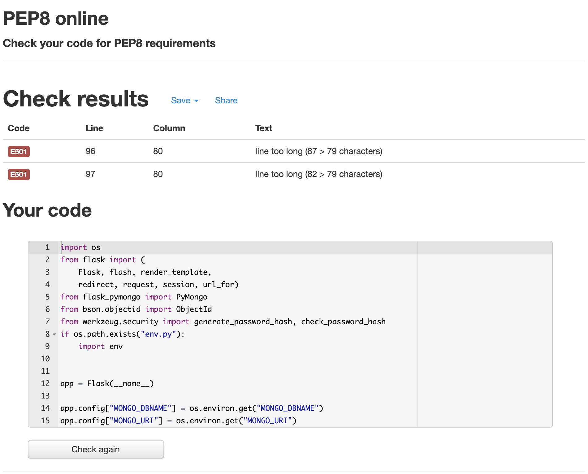

* **Update** Pep8 compliance now passes 100 per cent, my mentor Allen helped me in my final session with correcting linting errors within the app.py file which included correctly separating lines so they weren't too long and indenting those so everything passed the linter. He also explained that how I separated the python code in app.py was essentially right but showed me the pep8 way and corrected those errors as highlighted below. 

**If Statement correctly spaced at the opening brackets and indented correctly**

```python 

@app.route("/profile/<username>", methods=["GET", "POST"])
def profile(username):
    # grab the session user's username from db
    username = mongo.db.users.find_one(
        {"username": session["user"]})["username"]

    if session["user"]:
        reviews = list(mongo.db.reviews.find(
            {"created_by": {"$eq": session["user"]}})
        )
        return render_template(
            "profile.html", username=username, reviews=reviews
        )

    return redirect(url_for("login"))


   ```


### **HTML Results:** 
All HTML pages validated and passed tests however using Flask and the way we extend from the base template we do see expected errors in each page such as Doctype must be declared first and special character escaping, however, this cant be circumvented and I am aware and happy to proceed with this. 

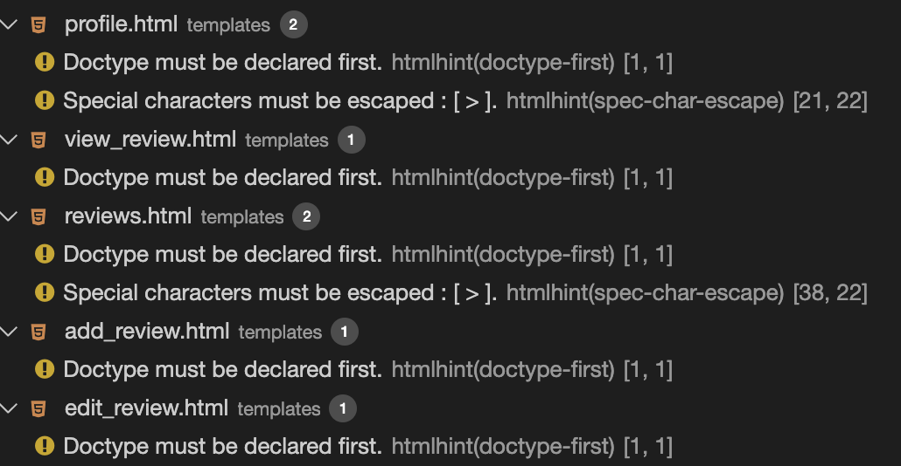


### **Other Testing criteria:**


* I Used the Gitpod built-in HTML testing.
I should also add that this tool brought to my attention that as I was using multiple forms on pages that my ID's needed to be unique, an issue which was quickly rectified but easily overlooked. 
what I do like about this tool is that it even tells you what line to look at for the aforementioned error.


* Emmet is also a great testing tool as if you do get errors or unclosed tags it will suggest to you the closing tag to use. I find this very helpful in bug fixing and testing.


* I have an extension installed called PRETTIER which is referenced in technologies, which I employed for correct 


* I finally used **[GTMETRIX](https://gtmetrix.com/)** which is used to test page website speeds. All testing came back fine apart from image sizes which scored pretty low. Thus I used the free online **[SQUOOSH](https://squoosh.app/)** to reduce massive image sizes up to 80% of their original file size. This is especially important as large image sizes dramatically increase page loading speeds and leads to a bad UX especially on mobile where heavy loading sites can eat data very quickly. 

___
### **Testing Issues / known bugs:**

**_Custom Fonts not loading correctly on mobile when deployed to Heroku._** 

 I discovered this bug when I accessed the flask app on my mobile to test a different function, this will have to be explored as the custom font used (Lakeshore brush) doesn't show up on mobile versions of the application, however, do when published to GitHub pages, so the error resides in Heroku. 
 **UPDATE SQUASHED** - GitHub path was incorrect and also in style.css I had a - in the font name which was not needed. This fixed error.

* Other bugs - at present (final meeting with mentor tomorrow ) - logo only works on the home page and doesn't work on any other page, leaving as a bug unless fixed tomorrow. 
**UPDATE SQUASHED** - Missing / in file path name prevented logo from showing, now fixed, the same fix for favicon bug, missing /. 


> #### NOTE _After mentor meeting I went through the various bugs and Allen helped me fix them, there are no known bugs now in the deployment of this flask application._


 ## 🏭️ **Deployment:**
 ___

This project was developed using the Gitpod IDE which integrates seamlessly with Github, Git pod is a cloud IDE so this allowed me to work at home on my iMac or out on my iMac using only an internet connection and the website **[GITPOD workspaces](https://gitpod.io/workspaces/).** 

The site was developed inside of the Gitpod IDE and connected to my GitHub repository. 
As sections of the site were completed I ensured that I used version control to maintain copies of my code on the repository. This was achieved via commands on the terminal integrated with Gitpod.

### **Steps in using version control and getting ready for Deployment**

1. `git status` - would give me a list of the files which have been edited and ready for staging.
1. `git add .` - I used this command to add **all** files to the staging area instead of adding each file individually I used the `.` after `Git add` which allowed all files to be added at once, I found this workflow quicker and easier.
1. `git commit -m"Message"` - This is the command to commit the changes and the message allowed me to know what or significant changes had been made.
1. `git push` - Was used to push to the remote repository, in this case, **GitHub**

When working it was also necessary to view the changes to the website, for this I mainly used preview, as the save function allowed instant refreshes and updates reflecting my changes. However for fullscreen testing in a separate tab, I employed the use of the command `python3 app.py"` to open a port on my local machine, instructions were to make the port public then open in the browser. 

## Deployment to Heroku 

This project is connected to Heroku using automatic deployment through connection to my GitHub repository, this was achieved through the following steps. 

1. Firstly and foremost one should create a new repository over at GitHub creating an env.py file to store sensitive data.

2. We must create two initial files in addition to this in our preparation these include the requirements.txt and Procfile, Requirements.txt essentially tells Heroku which dependencies are needed to build the app and the Procfile specifies the commands that are executed by the app on startup. 

3. To create the requirements.txt  and **P**rocfile we will use the commands as follows; 

    • $ pip3 freeze --local > requirements.txt
    • $ echo web: python app.py > Procfile 

     > **Note:**  Procfile music be capitalized !!!

4. Log in (or Register) to [Heroku](https://www.heroku.com/) and from your dashboard click 'new' > 'create new app'.


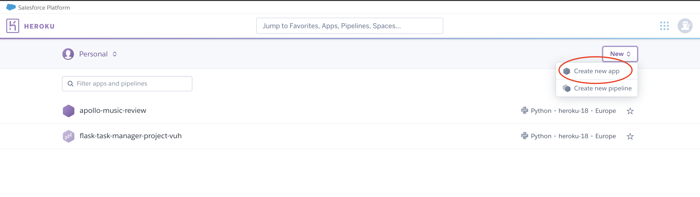

* Name your app something unique and select the region closest to you, in my case this is Europe.
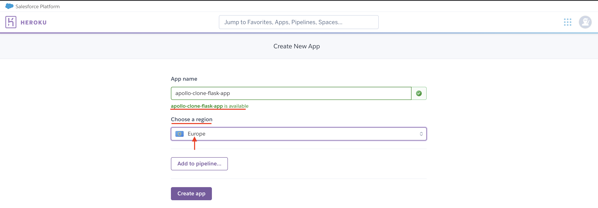


5.Connect up Github for automatic deployment - from the Deploy, tab select Github from deployment method.

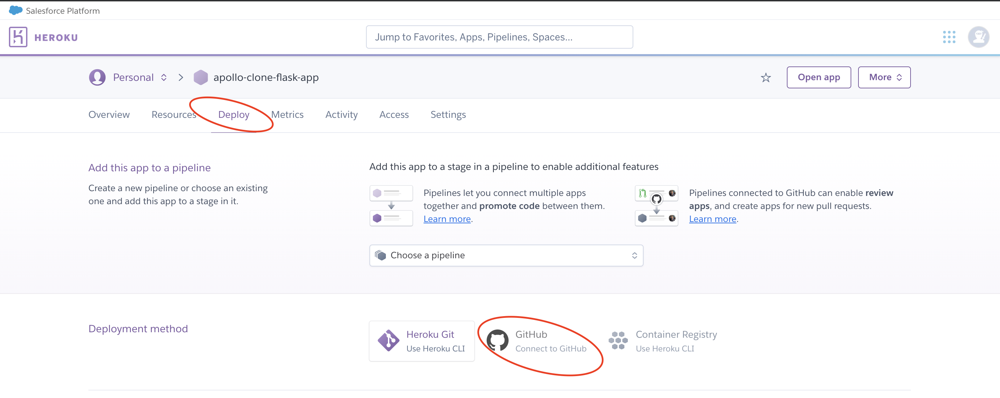

6. On the Github connect section ensure that your GitHub profile is visible than on the right-hand side box, type in a repo from GitHub to search for. Preferably it is advised that you keep uniformity within Heroku and GitHub so try to keep the same names for each. For this example, I have used apollo.

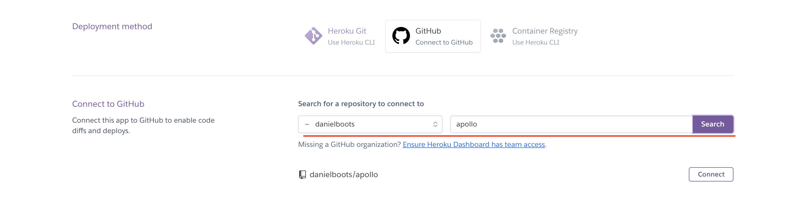

7. Once connected head over to the settings tab on Heroku and click on the reveal config Vars button as shown below 

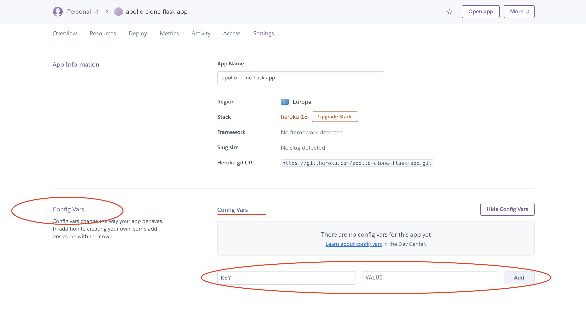

8. We use config vars to input our sensitive data and store it on Heroku so Heroku has access to these values, as they are the same values contained in the env.py file which isn't uploaded to Github. 

the variables required are as follows (key and value pairs) and are to be input exactly like your env.py file.


| KEY      | VALUE     | 
| :------------- | :----------: |  
|  **IP** | USER SPECIFIED   | 
| **PORT**  | USER SPECIFIED | 
| **SECRET_KEY**   | USER SPECIFIED - i use randomkeygen.com | 
| **MONGO_URI**    | MongoURI | 
| **MONGO_DBNAME**   | Your MongoDB Database name. | 


9. Once this step has been completed we can then push our requirements and Procfile to GitHub using the commands in the terminal ` git add requirements.txt ` ` git add Procfile ` 

` git commit -m"added requirements and Procfile" ` 

then push to GitHub using `git push` command in the terminal.

10. Head over to the Deployment tab on Hero and under Automatic deploys click Enable Automatic Deploys' and then Deploy Branch See below. 

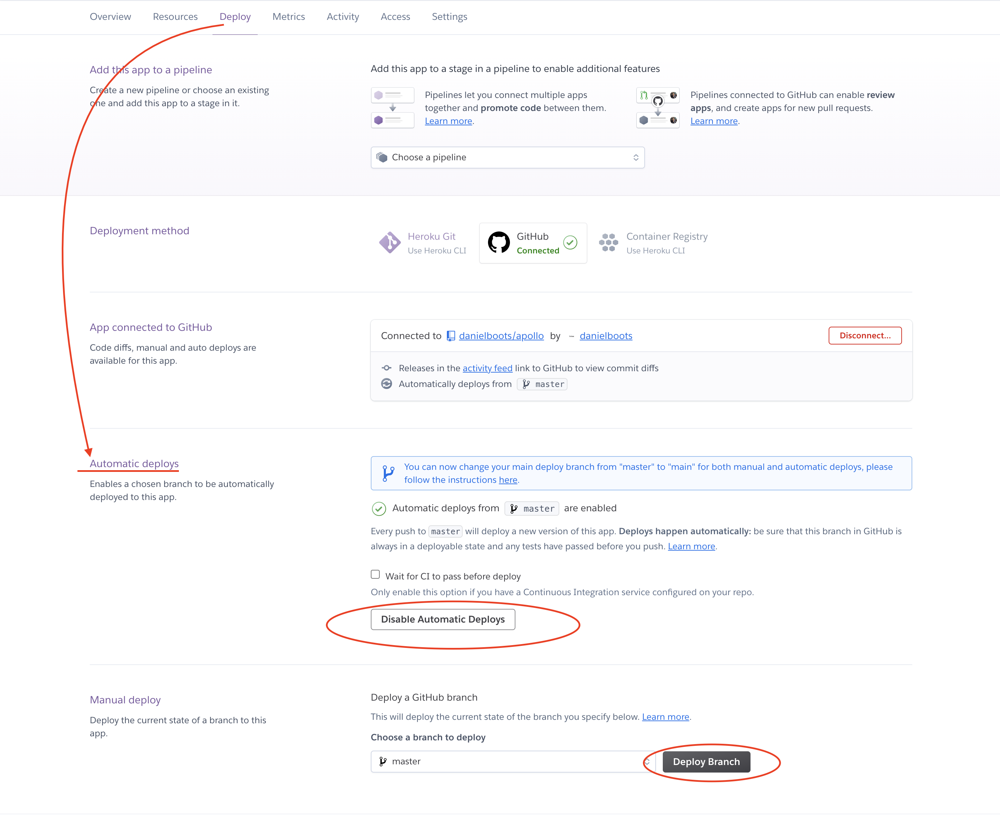

11. Following these steps correctly will allow Heroku to receive code from your Github repo and build the flask app using the correct packages and dependencies. 

12. Once the build has completed you will get a message informing you that ' your app was successfully deployed' and you can then launch your app. 


### **How to clone or run this project natively using HTTPS.**
If you should require to fork or obtain a copy of this website you can follow these instructions. 

1. Visit my Github repo here **[Apollo Repo](https://github.com/danielboots/apollo):**


2. Click on the GREEN clone or download button, located at the top right of the page see screenshot below.

   
     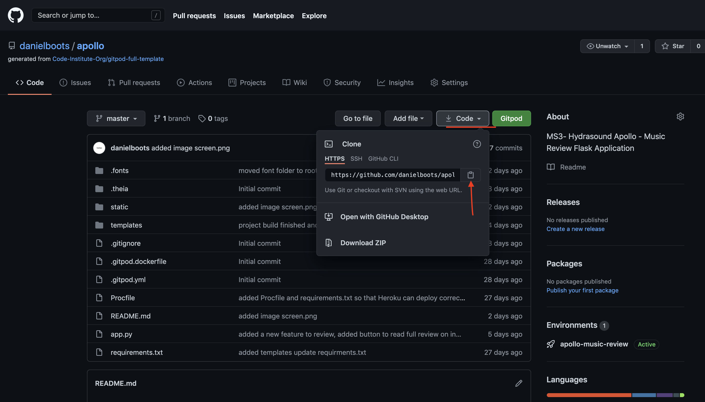

3. Click on the "clipboard" also located on the right now seen as a dropdown box. You can either click the clipboard or the URL if using URL method remember to right-click highlighted URL and copy.
4. Open your IDE and open a new terminal window.
5. Change the directory path to a location in which you want to clone the repo too. 
6. Paste the Git URL and click ok / Clone etc. 


 ### Additional steps required to allow the Flask app to work. 

### Create the env.py file

1. in the root directory create a env.py file to store your custom environment variables as follows.
- Import os 
   - os.environ.setdefault("IP", "user specific") 
   - os.environ.setdefault("PORT", "user specific") 
   - os.environ.setdefault("SECRET_KEY", "user specific") 
   - os.environ.setdefault("MONGO_URI", "user specific") 
   - os.environ.setdefault("MONGO_DBNAME", "user specific")

> **Note:** For this project I used MongoDB for the backend NoSQL database, if you want to clone this repo and allow for a functioning app you will need to set up an account over at MongoDB, instructions on using this 3rd party service can be found on their website. 

#### **Deploy the site to Github Pages.**
Follow these steps to then launch the project using Github pages to be viewed live on the web.

1. Enter the _MPS Repository_ from the Github Dashboard.

     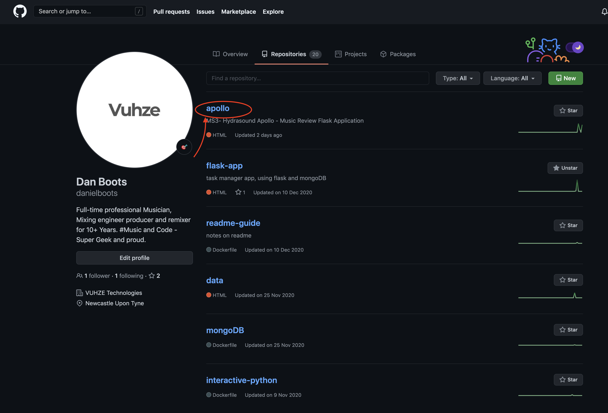


2. Click on the settings tab.

    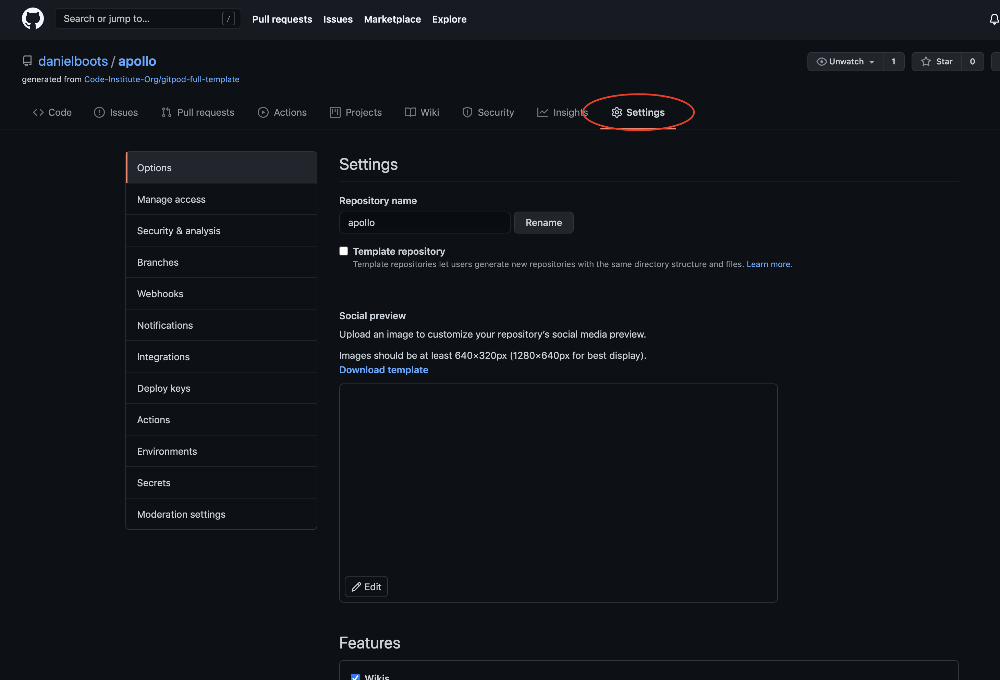

3. Scroll right to the bottom of the page options where you will find the "**GitHub Pages**" Options.

   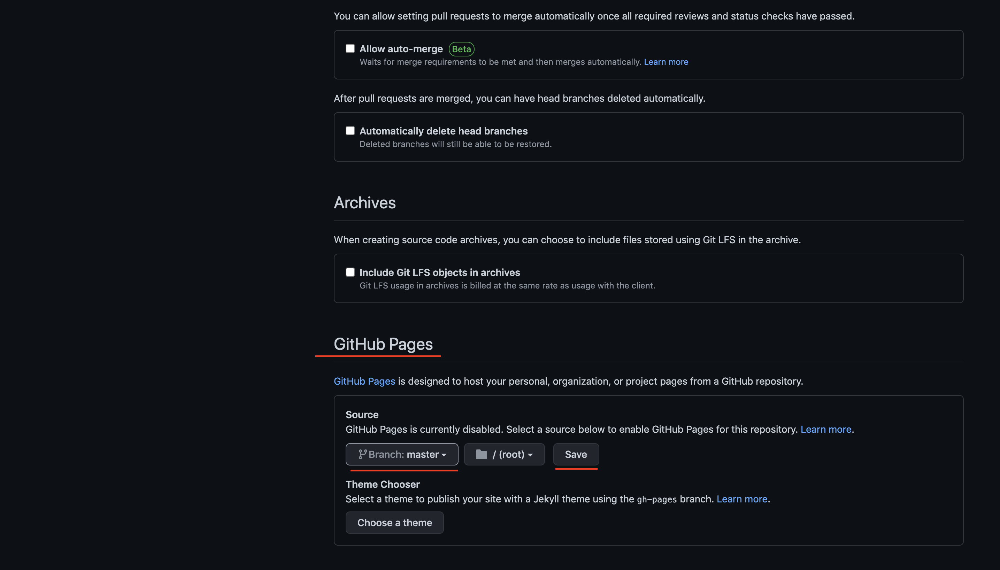)

From the "Source" option, chose "Master Branch" from the presented options.
The page will refresh and you will receive a notification saying. " _**Your site is published at: [https://danielboots.github.io/apollo/](https://danielboots.github.io/apollo/)**_"


___


## 🤝 **Credits Acknowledgements and References.**
___

### **Content**
The content for the website was taken from an old version of https://hydrasound.com my business website which one of the features was in part rebuilt for this project in this case the reviews section.


### **Media - images** 
Throughout my project, I used various sources for media - 

#### **Reviews images for example have been directly sourced from google searches along with review text. Examples:**

* **Don Diablo Review:** 

* https://ventsmagazine.com/wp-content/uploads/2019/11/KHnZ10kw-660x330.jpeg

### **Other image media links:**

* **Armin Van Buuren Review Img:** https://i.pinimg.com/originals/ef/d9/99/efd9993e6c92374ec9e2446813c87283.jpg
* **Mark Knight Review Img:** https://m.media-amazon.com/images/I/716qJH+ws8L._SS500_.jpg
* **Jamiroquai Review Img:** https://media.pitchfork.com/photos/5929c35b69fc7814a47cd619/1:1/w_320/856cad74.jpg
* **Joel Corry Review Img:** https://m.media-amazon.com/images/I/91cSY6EY5mL._SS500_.jpg
* **Luke Bond Review Img:** https://images-eu.ssl-images-amazon.com/images/I/61X0UHeNzQL._SX342_QL70_ML2_.jpg
* **AVB Fiora Review Img:** https://m.media-amazon.com/images/I/61RCGtsceXL._SS500_.jpg


* **All other Media images** -  From my own website - which was located at https://hydrasound.com 
* original content for these logos came from **Pexels**, **Envato Elements** and **https://Hydrasound.com**

### **Code Snippets** 


* **NavBar** - MDBootstrap -https://mdbootstrap.com/docs/jquery/navigation/navbar/
* **Forms** - MDBootstrap - https://mdbootstrap.com/docs/jquery/forms/basic/
* **Cards** - MDBootstrap - https://mdbootstrap.com/docs/jquery/components/cards/

### **Tutorials** 
The initial code for this flask application was built heavily around the flask app tutorial from code institute modules, as part of my full stack web developer course, I could not have achieved this fully functional CRUD application without the extensive and comprehensive guide which I followed and adapted to my own needs. 

* Custom 404 error page - https://htmldog.com/techniques/404/

### **Custom Code** 


* **Profile extended to display users own reviews** - My mentor Allen Varghese helped me with this section and provided the code 

` {"created_by": {"$eq": session["user"]}}
` 

Which subsequently allowed me to display all of the user's reviews on their profile page which I think is a great way for users to see and manage their content. 


### **Animation Css External Libraries** 

* **Animation Hero text** - Animista library - https://animista.net/play/text/focus-in/text-focus-in

### **Additional** 
* **Code Institute Projects** - Previous projects were referenced when needing to job memory on **HTML** structure or some **css** classes.
* **[Gitpod Emoji Code 0.9.0](https://github.com/idleberg/vscode-emoji-code#readme):** - Allows emoji use in markdown. 
* **[FavIcon- Instructions](https://www.youtube.com/watch?v=pA8103S-yqk):** - Allowed me to add a FavIcon to my site.
* **[FavIcon- Converter](https://www.icoconverter.com/):** - Allowed me to Convert my 16x16px photoshop image to a .ico file.


### **Thanks** 

I would like to thank once again my mentor Allen for his continued support and general guidance and chats we have not only about project-specific but moving forward, I like to ask him questions about future-proofing myself to which he happily gives me so much good advice on, not only that but also telling me about the chrome plugin Responsive Viewer, which saves so much time!! Thanks, Allen.

I appreciate his time going through the code institute handbook with me and ensuring that we covered all criteria and to both of our satisfaction.

Also my fiance and my family and children, again, as I progress through this course, my daughter is now 7 months and teething, so I'm running on zero sleep but I'm doing this in turn for my family and one-day ill look back at this repo/project and smile! 

To anyone else, you know who you are. 


### **Contact:**

> If you have enjoyed using this project or wish to connect with me my direct email is: 
**_dan@musicproductionservice.com_**
Thanks for passing by! 
