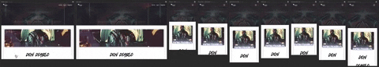

# **Milestone Project 3**  - Data Centric. 

## 🎵 **Apollo - Music Review Site**




Apollo Music Review is currently deployed and can be visited directly at Heroku **[Apollo Music Review ](https://apollo-music-review.herokuapp.com/)**


--
## 📓 **About the project:**

**Apollo Music Review**  is a  music review website built using the flask framework, simultaneously allowing users full C.R.U.D functionality of their own music reviews.

## 💻️ **Technologies Used:**
___

* **[HTML](https://developer.mozilla.org/en-US/docs/Web/HTML):** - Is the main language used in this project which allowed me to correctly structure the website, whereby using best practices to use semantic tags where appropriate.

* **[CSS](https://developer.mozilla.org/en-US/docs/Web/CSS):** - Was used via an external stylesheet using best practices to style format and visually present the HTML.

* **[FLASK](https://flask.palletsprojects.com/en/1.1.x/):** - A python framework 

* **[HEROKU](https://www.heroku.com/):** - Heroku is a container-based cloud Platform as a Service (PaaS). Used in this project to deploy live site to the web.

* **[PYTHON](https://www.python.org/):** - Python is a backend programming language

* **[MONGODB](https://www.mongodb.com/):** - MongoDB is a NoSQL database, based on JSON format, using key value pairs to store data in clusters / collections, which can be retrieved via Python.

* **[WERKZEUG](https://werkzeug.palletsprojects.com/en/1.0.x/):** - Used in user password hashing and security for the application.

* **[RANDOMKEYGEN](https://randomkeygen.com/):** - Website used to generate secure passwords, used in this application for ***SECRET_KEY***.

* **[JAVASCRIPT](https://developer.mozilla.org/en-US/docs/Web/JavaScript):** - *As part of Bootstrap* Javascript although i havent programmed it, was included in the site as part of the Bootstrap framework so that some Bootstrap components such as the navigation toggler would work.

* **[JQUERY](https://jquery.com/):** - *Extensive parts of the web application are programmed in jquery, click event listeners on page loads and loading of the users data all employ the use of jQuery.*

* **[BOOTSTRAP](https://getbootstrap.com/):** - The framework for the site allowing use of the Bootstrap grid and responsive mobile first approach. I Used many components from Bootstrap mainly, the Carousel, Nav bar, forms and modals. 
* **[MDBOOTSTRAP](https://mdbootstrap.com/):** - The framework based on Google Material Design for Bootstrap. 

* **[GITPOD](https://gitpod.io/):** - IDE for this project. Allowed me to fork the Code Institute template from Github and open in Gitpod so that all extenstions were available.

* **[GIT](https://git-scm.com/):** Git employed as version control

* **[GITHUB](https://github.com/):** - Github was used to host the repository for this project.

* **[SQUOOSH](https://squoosh.app/):** - I used Squoosh in order to reduce the image sizes

* **[PHOTOSHOP](https://www.adobe.com/uk/products/photoshop.html):** - For editing images associated with this project.

* **[BALSAMIQ](https://balsamiq.com/):** - Mac version to develop wireframes for this project.

* **[CHROME](https://www.google.com/intl/en_uk/chrome/):** - Not only did i use Chrome extensively for testing and bug fixing but I used the following extensions :

* **[PESTICIDE](https://www.google.com):** -  This extension inserts (with auto reload) the Pesticide CSS into the current page, outlining each element. - Giving a good visual representation of containers rows etc, as i was using material design from MDBootstrap i was inserting containers in to containers in points to get the desired layout and style, this extension allowed me to view the layout correctly. 

* **[RESPONSIVE VIEWER](https://chrome.google.com/webstore/detail/responsive-viewer/inmopeiepgfljkpkidclfgbgbmfcennb):** -  An excellent extension suggested to me by my Mentor Allen - A Chrome extension to show multiple screens in one view. the extension will help front-end developers to test multiple screens while developing responsive websites/applications.

* **[GIFY](https://giphy.com/):** - Used to create the .gif file in readme depicting the responsive viewer in action and showing my testing on different screen sizes. 

* **[WEB FONT GENERATOR](https://www.fontsquirrel.com/tools/webfont-generator):** - Used to bring in a custom font i wanted to use for the main H1/ H2 sections, custom branding.

* **[AM I RESPONSIVE](http://ami.responsivedesign.is/):** - Used to generate the header image displayed at top of Readme.md file depicting 4 screen displays.


___

## 🧑‍🎨 **UX:** **User Experience Design (UX)**

 __Developed from the code institute full stack web developer module on UX design.__

**What is UX:**

User Experience Design is the work, processes and skillsets involved in creating useful useable products which provide value not only to the customer but the business owner ensuring that a product not only works but is intuitive, simple, and enjoyable to use.. A good UX experience is achieved by following a defined process called User Centred Design or UCD for short.

I haven chosen to create a music review website with full C.R.U.D functionality and also login and registration forms, complete with password hashing from **Werkseug** following best practice UX principals and will apply them to reassess the current needs and wants of my customers and future potential clients.

I felt like tackling a business which I am currently involved in would give me a better understanding of implementing UX principals which will then allow me to generate better UX designs in the future with a stronger understanding of the core principals.

I will aim to cover the different planes in detail so that this document can be used as a blueprint for future UX development I undertake.


## 💡 **Strategy plane: The Initial idea.**
___
The basis behind the Apollo Music review site, was to start a flask web app which allows users to register / browse search and add their own music reviews, wether this is a professional release, from EDM to house music, to contemporary and amateur releases. 

Music review sites are a great way in order for musicians to self report and share their music online and a great way to gain exposure. Not only that but as a business owner allowing users to register on the site for no charge allows massive expansion of user generated content which i dont have to provide myself. 
This results in an ever increasing database of music and users attracted to the site, visitors and users can share their reviews again attracting more traffic to the site aiding in its growth.

 My primary aim was to bring together many of the technologies i have learned so far to then use these technologies and display data in a comprehensive way. I aim to bring in user generated data using forms (through a Add review form page) and python linked to MongoDB. Thus highlighting the many skills i have obtained during this course. 

 By completing a fully functioning music review site, i will have demonstrated my experience in developing a Pyton based web application with CRUD functionality.


 ## **About the business:**

The web applicaton will be entirely online and is concerned with real life music reviews from users who can sign up to the site for zero cost to themselves. The primary aim of the website is to display relevant reviews from users and allow them to share their reviews in order to accomplish two things, 1. Exponention growth through sharing of the website and 2. Expand awareness of the music that is being reviewed, be it from an independent musician looking for exposure or an individual looking for experience as a music journalist covering a major artists release. 

**Strategy to deliver above.**

* A clear and simple design starting with the Hero section displaying the Name and tag line to establish the message of the site.


**Branding:**
* I own the domain name https://hydrasound.com and my business name follows suit with the strap line and business idea name, following on from previous projects and aligned with the Greek Mythology i have chosen the project name Apollo who is the Greek god of music. 

* Logo - will be a simple design based on the letter A.

**Strategy to deliver above.**

All of the below points should fulfil 'user first impressions' (see table below) and is especially importance in our B2C business.

*	Develop a logo – which is simple but effective, based on the letter A and try to symbolise Apollo the letter A and a letter. See Logo on deployed site for final design. Logo will also act as a link back to the home page as common practice. Increasing credibility and trustworthiness.

* A simple design structure with navigation bar and side navigation on smaller screen resolutions accessible on every page will be essential for allowing users and readers to 'learn' the site and layout / functionality with ease. There should also be a home button / link on the logo for each page and subsequent back / return to reviews button generated on each page so that the user doesnt have to use the back button as this is bad UX. 

*	Develop a professional colour scheme – check out competitors in not only music but business-related websites. Use consistently throughout site. For this colour scheme i have went with a dark blue and greys signifying  trust, honesty and dependability, therefore helping to build customer and userbase loyalty. 


*	Choose a font type for the project which reflects what we are trying to achieve – research music platforms and use similar fonts. Spotify similar fonts -two come to mind straight away. “Montserrat” and “Poppins” Use consistently throughout site. Apollo will employ ‘Poppins font’ Again i have used this method from my previous milestone project as i feel in my portfolio i wish to create a style for myself, following on from similar design and practices, furthermore this is due to me wanting to work on a platform of products which will link to one another eventually. I feel like my own brand as 'Hydrasound' i should follow similar design patterns. 

*	Utilise the bootstrap card and grid system to display the users reviews in a logical and easy to ‘learn’ manner.

*	Develop a footer with info section or simple copyright info bar.


| User first impressions        | How to achieve          |
| ------------- |:-------------:|
| **_Does it look credible and trustworthy?_**  | Yes – through colour palette, fonts,  logo, social proof of good quality control and reviews. |
| **_Does it offer what I want?_**  | Yes – Simple use of CRUD functionality and achieves only what is intended, users the ability to register to the site, add reviews, edit and delete reviews. Readers of the site can view reviews on the home page and view extended versions of the review on their own pages, with easy access back to the main home page. |
| **_Does it look valuable enough for me to stay?_**  | .Professional design, clear and simple navigation, displayed is an easy to read manner. Mobile responsive. |
| **_Does it look valuable enough for me to return?_**  | Yes, free to use but professional design, deployed on a secure platform, quick responsiveness and easy to 'learn' with all features of a review site available |
| **_What actions can I take now?_**  | Users who arent logged in will see a clear navigation item which says 'register' |
| **_How do I learn more?_**  | An info modal is available giving a brief overview of the site and how to use it, along with direct buttons to register |
| **_How do I contact someone?_**  | Footer provides direct contact details for the webmaster. Similarly a webform can be accessed from a menu item called 'Contact'|


**What is culturally appropriate**
In relation to this music review project I have found that the brand name stands for a lot right from the offset. Our website is only concerned with displaying reviews within the music industry, so no Movie reviews or fishing rod reviews.
We keep the site strictly about musical endeavour and focus solely on providing the users the ability to Create their own music reviews, edit and delete them. They will also be able to build up their name as a music reviewer, as i have created the 'review_by' functionality at the bottom of the review. So users can build up a database of their own reviews, which can be displayed on their own profile page. Futther more by adding them to their own profile page we allow the user the ability to manage their own database of reviews, add to and review their work in their own section of the site. 

I have also developed the site to be mobile first as our demographic for clients looking for our services seems to be in the  male category and age range of 22-34, whereby we know its highly likely that users have access to a smart phone and will be accessing our website from mobile.

**Tracking and cataloguing content in an intuitive way.**

Regarding the display of the content I have opted for a typical section style layout to the site, this meaning I have a hero section and subsequent blocks of content each separated by alternating background colours, an off white and white to ensure content separation is apparent. 

The use of Flask /Python loops will allow the display of reviews in a card, each iteration will generate a new card with subsequent review. In time i may break these loops down to Genre specific headings and make reviews searchable by genre, however as the site is in its infancy i have opted to generate all reviews in cards utilising the bootstrap grid system displaying no more than three cards per row.

Typically in modern web design a hero section is employed so I have taken advantage of that with a centered H1 and H2 Heading for site title and strap line, using a more bolded font to make an impact from first page load. This screams to the user, this is the site title and this is what you can do here.

I also used a background image which is relevant (musically) to display the field the website is addressing. One concern is the bright image was taking away from the Hero text, so a background overlay was used in order to fix this. Not only that but the background overlay is the main colour in the colour palette chosen again adding to our branding and overall UX experience for the potential client.

**What is the importance of this.**

From the first time the user visits the website we want to display a level of professionalism and ease of use, not only that our strap lines, branding and colour palettes are correct but our content is distraction free and displayed easily enough that a user can learn about our website and feel at ease very quickly. 

With minimal distractions and a simple interface it will become easy for the user to quickly learn the site and sign up for an account and start creating content for the site. 

**Why would a user want this.**

There are other similar website applications available to the user which offer the same basic functionality as Apollo, so its important to quickly allow the user to learn the site sign up and create content with little distractions as possible. I have deliberatly simplified the application to allow for this. Typically a user from visiting the site can sign up and create a new review in less than 5 steps. 

1. Visit application 
2. Click Register
3. Register account.
4. Add review.
5. View Published review. 

This ease of use and free registration will encourage return users to the platform and again allow use to grow through external content creation. 


**What creates a good User Experience with regard to this online Music production service finder business.**

*	Strong branding – colour palette – typical industry typography.
*	Displaying relevant content. - From only hosting / allowing music reviews from Major artists and displaying content which is of value to readers.
*	Social proof – adding social sharing to all reviews allows for users to share their work and in return increases traffic to our web application.
*   Overall ease of use, as highlighted above, the 5 steps from learning the site to publishing is imperative. I have used previous sites which require far more effort and are often more complicated to learn. Simplicity is key.


**What does the user / client expect?**

*	Strong Branding- Does this website come across as an authority in its field. I feel this is true by the use of correctly structured content, branding font type and also consistency throughout.
*	Pricing – This is completely free, we may in our terms allow free use inorder to contact users at a later date to offer other premium services. 
*	Ease of use? - 5 steps from initial visit to signing up and publishing first review.
* Support - this is currently only available from a contact form, however as the site is simple and efficient i believe this is a minor addition to the free service provided. 


**Prioritisation – To launch a Minimal Viable Product.**

We can address which features should be prioritised primarily by developing a map of importance and viability/ feasibility.
For this project we will be focusing on UX efforts of higher importance and developing features of lower importance and viability/feasibility further in the timeline of this project.


| Opportunity/Problem       | Importance         | Viability  |
| ------------- |:-------------:| -----:|
| **_A.     Allow users to register and create publishing account_**       | 5 | 5 |
| **_B.     Display each review on their own page_**      | 4      |   5 |
| **_C.     develop a top users and ranking system for contributors_** | 2      |    2 |
| **_D.     Develop a chart system from the chilli rating functionality_** | 2      |    3 |
| **_E.     Group reviews to categories_** | 3      |    3 |


**Graph of importance in order to launch our MVP from previous table.**


As referencing the above prioritisation matrix my UX efforts will be hence focused on aread A and B which will satisfy the CRUD app criteria of the grading process. 
Thus i will develop the application to allow users to register and create their own accounts whilst also displaying that review on its own review page using an appropriate app route decorator to grab the review id and generating the content from MongoDB and displaying it on a page called view_review.html. 

By developing the app in such a manner it will allow me to simply hard code one page view_review.html and not create multiple pages for each individual review submitted.

## 🧰 **Scope Plane - requirements and functional specifcation**
___
### **What users and stakeholders - Say they need**
**User Stories**

* Speaking to a number of budding music jounalists i have found that very often people who want to become music journalists or write as a professional for magazines will be required to have some form of publishing past or evidence of their writings. 
Music reviewers or journalists will want to share their work with other people and if they dont have access to a personal blog, or want to be inclusive of other writers they will need to join a plaform which allows for this. 

* The user visiting this type of website wants a professional website easy to navigate and also read reviews of relevant content, for in this instance - Music reviews. 
* Not only that but if the user wishes to use the site to publish their own reviews they will also require a site that will allow full CRUD functionality, simplistic to use and allow their content to be displayed in an easy to read and eye inviting manner. 
* They need to be able to share their work across platforms. 

### **What users and stakeholders - Actually need**
They need a clean and tidy designed website which is mobile responsive, highlighting the latest music reviews, a button from the front page to allow the user to read the full review.

* As a user / publisher on the site they require ease of use with full CRUD functionality, inorder to publish ammend or even delete their work. 
* They will also need a means of sharing said content with others on their social networks or to potential employers. 

### **What users and stakeholders - Don't know they need.**

* As the site owner, they will want to be able to monitor and update the site, i have initially started this process by creating an admin user who has the capacity to create new genres and add those to the database. 

* As a working business website, we have to abide by GDPR rules, so a pop up advising the client on our privacy and how we use their information would be needed down the production line. This production app will not have this in place but will be if deployed.

* Other desirable features may include, more services for music promotion.

* Social networking feature – not essential but desirable, perhaps a twitter/facebook like entity where users can register to the site share their music writing tips and advice, this would allow for content to be shared cross platform and to other social media accounts, drastically increasing awareness of our web application. Or for people to use the site like a personal blog, create friends and discover shared interests. 

* An iOS and android app – its true that many users now if these features down the line are implemented that developing an application would be of extreme beneft, it would allow extra monetisation brand awareness and next level professionalism.


### **User Stories - Needs / Goals and how to achieve.**


#### Site Member

| Needs / Goals       | Task        | 
| ------------- |:-------------:| -----:|
| **1.     An easy to use music review site_**       | Make sure the site is easy to learn and easy to navigate | 
| **2.     Display each review on their own page_**      | Create the route app decorator to grab the ID of the review and use a template to generate the page pulling data of the review in from MongoDB       |  
| **3.     Discover new music and artists _** | Allow further search functionality alongside adding charts for top rated reviews and users, this will encourage use of the site more frequently.      |    
| **4.     CRUD functionality _** | Give access to features allowing the user to Create, update and delete their reviews with out the need for an administrator      |    
| **5.     Exploration of the site _** |   Group reviews to categories, employ the use of carousels for swiping of reviews, or categorise by rating / genre    |    


#### **Site Owner**


| Needs / Goals       | Task        | 
| ------------- |:-------------:| -----:|
| **1. Share my own reviews**       |Giving access to full CRUD functionality |
| **2.     Management of genres**      | Administrator account has a separate function to create new and accessible genres for all users to take advantage of. This can only be managed by the admin account, thus encouraging users to reach out to site administration to add specific genres, this stops users adding genres which are unknown or not uselful to the site.      | 


**First time visitor Goals**

* Allow visitors to learn that the site is a music review site
* Home screen promting registration if logged out. 
* See snippets and general rating of reviews on the home page.

**Frequent visitor Goals**

* Encouragement to register for more functionality.
* Read and learn more about the music and reviewers on the site.
* Share the music reviews to their own socials.
* Publish their own music reviews with the CRUD functionality so ability to edit and delete if needed (encouraging publication as can be deleted if not confident)


**Development Goals**

* Demonstrate a solid foundational knowledge of the Python language and the Flask mini framework.
* Increase knowledge of MongoDB through CRUD dev.
* Build up portfolio of relevant projects suited to my needs (ie music industry). 

**Website owner Goals**

* Encourage site use and exposure from allowing sharing and having a site that is easy to learn and use. Simple and effective interaction. 
* less steps to publishing as possible vs competitors. 
* Easy registration to onboard new publishers, allowing for exponential growth through 3rd party content creation.


## 🏗️ **Structure: How we present information:**
___

The web application will consist of a typical navigation and structure which will conform to web best practices. By this we would expect the navigation menu items to be located to the top right hand corner of the web app. To the left we will employ a Navigation bar logo which doubles as a main Home or index.html link.
As it stands there will only be 2 pages, this is because i have employed the Flask templating  method to my web application, end point url for users will be view_review.html and an associated review ID pulled from MongoDB. This implementation was chosen as i dont have to create new pages per review generated, i am gathering all data from mongoDB for all reviews.

The menu items are only one level consisting of a linear structure, so no nested pages as of yet. The structure is as follows.

#### **LOGGED OUT USERS:** 

#### **HOME---LOGIN---REGISTER :** 
* For logged out users, the user will only have access to options which encourage registering to the site. A login option or a registration option.

#### **LOGGED IN USERS:** 
#### **HOME---PROFILE---ADD REVIEW---GENRES(ADMIN LEVEL)---LOGOUT :** 
* If the user is logged in, a more extensive list of menu items are available, for instance the ability to add a review, will allow the user to visit the add review page and add a review. 
* A profile page will allow the user to display their own reviews, each with buttons for CRUD functionality.
* Admin level will have access to Genre level, whereby the admin can add custom Genres to the database and manage accordingly.
* Finally logout for users to end their session and securely logout from the application, removing the session cookie. 


### **Information on structure regarding page layout and design.:**
 The general structure of pages will consist of a nav bar, a hero section and then relative content to that page, structured using the projects fonts, font sizing and colour palette.
* As discussed earlier I have opted for a content block approach which will allow me to display content in a clean and structured manner. These two points allow the user to learn the layout and feel of the website quickly.
* Each page will have working navigation whereby the Apollo **A** Logo will return the user to the home or landing page.


* The footer/ Copyright consists of two sections positioned centrally and away from the edges of the site so that any information can be viewed with out scanning from left to right on larger screen resolutions. I discovered this as I work on a 27inch iMac and having content full width at this size is bad for UX in my personal experience.
Regarding the footer, section one or block one will have an information box
section the second will offer my own contact details.

* view_review.html will be a hard coded template page which pulls in **BSON** data from MongoDB, this will allow me to create one hard coded page allowing me to display the correct review data for the selected review. 


### **IXD:**

Hero section is not full viewport height it uses the CSS style  `height: 45vh;` with next sections always visible, this promotes scrolling and intrigue.
* Colours fonts and structure are reused throughout the site.
* I did however add an animation class from Animista which was used throughout the site on the hero text and strap line,
it plays once on page load and is a fade animation, which I feel adds a subtle but impressive introduction when visiting pages. No further animations are employed, so as to not over complicate or draw attention to less important areas other than the reviews themselves.


## ✏️ **Skeleton Plane – Interface design, navigation design and giving form to function:**
___

As with every project which is to be taken in to production it was essential to firstly wireframe the project. This would allow me to test out different ideas layouts, navigation and presentation which is expected when visiting this type of website. I developed the wireframes using the Balsamiq software which allowed me to produce low fidelity mockups of the finished web application without the need for coding it first. This saved immensely on production time and allowed me to have a 'map' of how to fnally code the app.

_**Please note – these wireframes may difer slightly from the end result.**_

___


#### **Index Page - Wireframe.**


#### **USERS - Wireframe.**


### **Skeleton plane cont:**

In this project we are only focusing on data presented and data in motion through the use of BSON from MongoDB and the input of that data provided by registered users of the application.


The data presented should be done so in a logical manner with ease on the eye and interesting to the end user, it should also be simple to read and only present important data as to alleviate cognitive overload from the end user. This is acheived by presenting only the important pieces of information from the review as needed, in this case: 

* Artist Name - using a secondary font
* Artwork - As a heading image.
* Track Name - in bold part of info block
* Album title - in bold part of info block
* Chilli rating - In Red and bolded employing the use of correct amount of chillis to reiterate score.
* Review - A simple text block, spaced as justified text for ease of reading and presentation of said text.


Navigation has been assembled in order of priority from left to right and all links and internal links are well displayed (many as buttons) and working.

Furthermore I found no need for pagination at this point to display data and also provided menu items and buttons with relevant font awesome icons to aid in web application learning to the end user. Data is presented the same throughout the web app alongside colours, fonts and branding all aiming to allow the end user to learn the web app easily and subsequenlty enjoy using it.


### 🚀 **Surface plane:**

Using all the planes above and the data presentation and all the research carried out I was able to present all of this with my project.
I hope you enjoy browsing my web app and I look forward to developing it further.
In ending this UXD analysis and a quote I feel summarises this whole process I will leave you with this.

> “ Good UX smells like value. Ask yourself the question whenever you're building a project, does this smell like value?”

Brian O'Grady - Code Institute


## 📦️ **Features:** 

* The web app is totally mobile responsive with a collapsible toggler navigation. I used a mobile first approach to this project ensuring that mobile access was of high importance.

* The Logo position left always takes the user back to the Home page.

* Expected use of font awesome icons to assist in users learning of the site.

* Use of animation for hero text - minimal use of animation but effective for a pleasureable experience on page load.

* Footer features on Index.html with infomation section populated with my personal infomation. 

* Reviews utliizes bootstrap cards which display Artwork image and content relevant to the review, encouraing click through from the button below.  This was templated using the Flask framework. This allowed the developer to create one template card which was used to create all the data cards for the users, through creating loops for the reviews.

* A user friendly interface with easy navigation and learning of the whole application, through minimal design, visuals and information presented in a predictable but expected fashion. 
Furthermore, all fonts and colour schemes are consistent throughout the application, from login panels to registration, all consistent to create a continuous feel and wholeness to the app. 
Expected font use and consistency in font sizing and weights allow for an easy reading experience. 

* Buttons are all styled the same and placed strategically to ensure the user has an enjoyable experience using the site. 
* Forms are all styled using MDBOOTSTRAP's form control giving a slick and professional look instead of the standard form design. 
* Card use for review listing and uniformity. I have used cards concurently in my projects as i feel they are an exceptional way of containing and managing content to present on the site. 

* Search functionality - was extended to incorporate most iterations or expected search strings and enquiries, so if a user wants to search by genre, track name, user, or any other typical string the search functionality can handle that. 

* Flash messages are employed to allow / alert the user if they have logged in, logged out, submitted a review to the site correctly etc.


### **_Code Refactoring_:** 
___
In this project i also used the extension to Gitpod called prettier which would format my code, however i then went through each page 
and ensured there were no excess lines of whitespace. I also chose a uniformed way of commenting display, whereby i left a line gap either side of my comments so that people can distinguish between code blocks. I feel it was just a neat way to format my comments. 

## 🧪 **Testing:**
___

Testing was an integral part of the design and build process, responsiveness is cruicial to the success of any online website so a number of steps were employed to ensure that the site worked across a number of platforms and browsers.
Not only responsiveness but positioning, colours, inheritence etc were all factors to be taken into consideration, thus Google Chrome developer tools was used extensively to test all aspects of the site.
Although Bootstrap is a mobile first approach i opted to work on a simple desktop version first as i could work backwards.
I first of all set up a few .css rules for the body section which allowed me to set some global rules such as.

<!-- Code Blocks -->
``` Css
  * {
  box-sizing: border-box;
}
```
Which made sure that i was working with the box model more logical. 

One other major factor i came across is when using `.container-fluid` my content was as expected at full width across the screen, which for some sections i liked but on bigger screen resolutions i found for UX purposes i needed to set a max width so that the content didnt spread across the page. I found this looked sloppy and not good in terms of design. I tested this too out with dev tools to create a `.container-max` rule which for large screen resolutions the content was displayed better.
Resulting in: 

``` css
/* container to pull in content on non full width containers */

.container-max {
  margin-left: auto;
  margin-right: auto;
  max-width: 1400px;
  padding: 15px;
}

```

Furthemore i implemented a media query after using the Repsonsive Viewer extension for chrome and it was evident that the hero txt on smaller screen resolutions such as iphone 6-7 it felt like the hero txt was too low in comparison with other screen sizes i used this code to rectify the problem and images below show a before and after comparison of a better looking UX 

```css
/* media query from chrome - addition of this media query to line up hero text better on smaller screen sizes. */

@media all and (max-width: 425px) {
    .hero-text h1 {
    font-size: 50px;
}

/* media query from chrome */
 
   .hero-text {
    text-align: center;
    position: absolute;
    top: 30%;
    left: 10%;
    right: 10%;
    color: white;
}

```


## 🧪 **User Experience testing:**